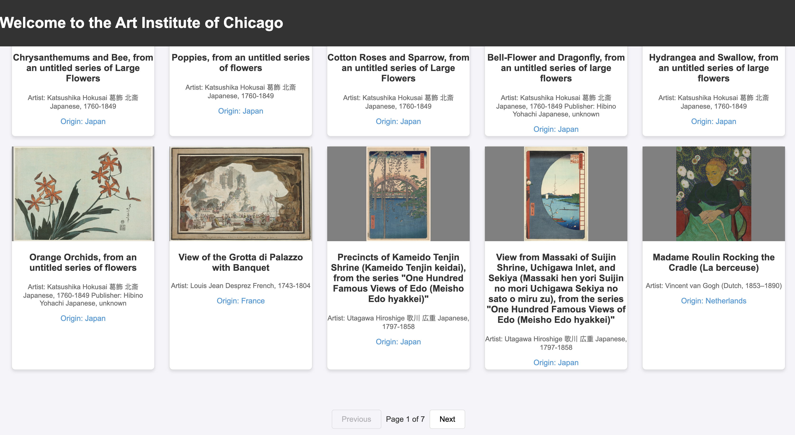

## How to run the app on your local machine
Step 1: Clone the project to your computer `git clone https://github.com/linh-pham19/ctd-prework.git` 

### If you have Python installed

Step 1: Navigate to the project folder on your local machine
Run command `cd /path/to/your/project` in your terminal

Step 2: Start the server
Python 3:
Run command `python3 -m http.server` in your terminal

Python 2:
`python -m SimpleHTTPServer`

Step 3:Open your browser and go to `http://localhost:8000/index.html`

### If you have Node.js installed
Step 1: Install `http-server`:
Run `npm install -g http-server` in the terminal

Step 2: Navigate to the project folder on your local machine
Run command `cd /path/to/your/project` in your terminal 

Step 3: Open your browser and go to `http://localhost:8000/index.html`

### Install Live Server

Step 1: Open Visual Studio Code

Step 2: Go to the Extensions View

Step 3: Search for "Live Server" and install it

Step 4: Open your project folder in VS Code

Step 5: Right-click on index.html in the Explorer and select "Open with Live Server".

Step 6:Your default browser will open the app at a local address, such as `http://127.0.0.1:5500/index.html`.

# Upon successful loading of the endpoint to see all artworks 

Home Page View with Pagination

# After you click on `Visit our online store` button

# Documentation
Description: The app fetches artwork and store product data from the Art Institute of Chicago API and displays them across two separate HTML pages. Each page shows a maximum of 30 items, with a cap of 210 items fetched total to ensure fast load times and enable pagination. Search feature is only available for artworks. Users can search by keywords related to the item's title, artist, or origin. Search results update in real time with each keystroke.

# Design Reasoning
Even though the two HTML pages are very similar to one another

